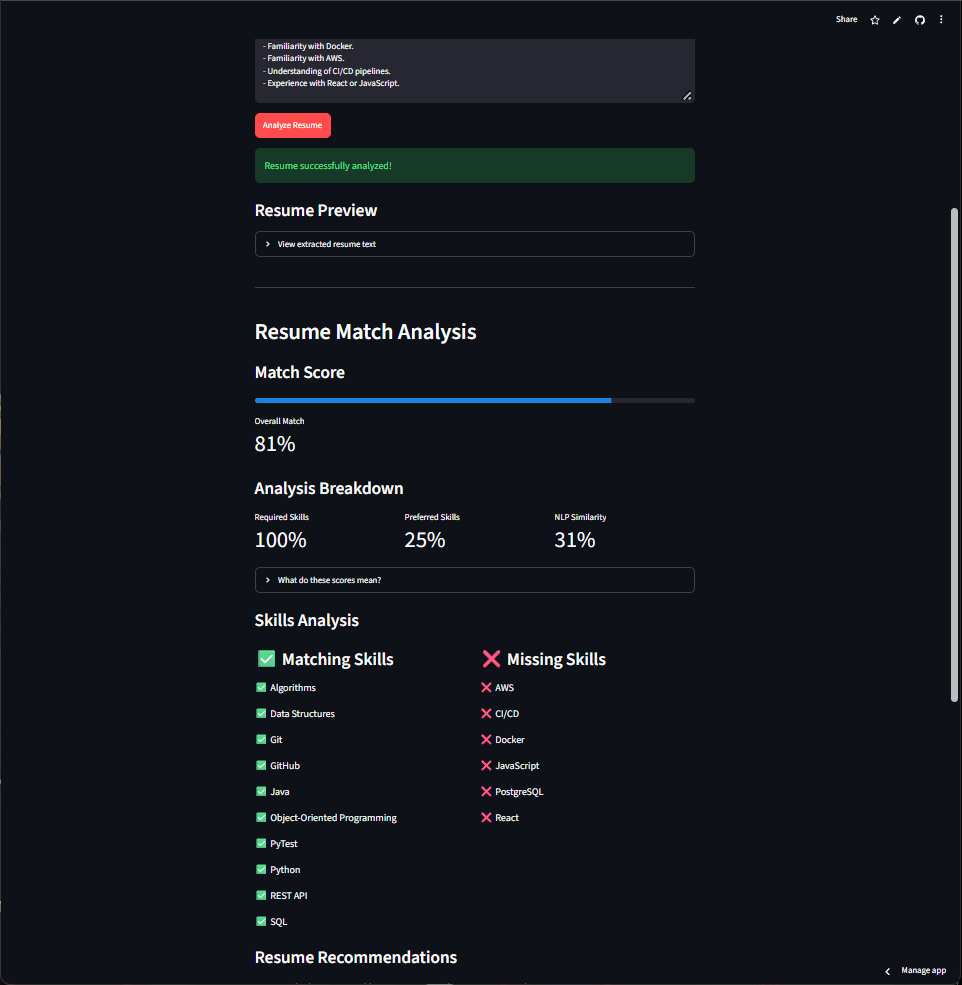

# 📄 AI Resume & Job Matcher

A Python web application that analyzes resumes against job descriptions using weighted skill matching and NLP-based text similarity.

## 🚀 Live Demo

[Launch AI Resume & Job Matcher](https://jordan-ai-resume-matcher.streamlit.app)

## 📸 Screenshot



## ✨ Features

- PDF resume parsing
- Required vs. preferred skill detection
- Weighted qualification scoring
- NLP similarity analysis
- Skill-gap detection
- Personalized resume recommendations
- Interview question generation
- Downloadable analysis reports
- Input validation and PDF error handling

## 🛠️ Tech Stack

- Python
- Streamlit
- PyPDF
- scikit-learn
- TF-IDF Vectorization
- Cosine Similarity
- Git & GitHub

## 🧠 How It Works

1. User uploads a PDF resume.
2. PyPDF extracts the resume text.
3. The application detects and normalizes technical skills.
4. Job requirements are separated into required and preferred skills.
5. A weighted qualification score is calculated.
6. TF-IDF and cosine similarity compare the resume and job description.
7. The application identifies matching and missing skills.
8. Personalized recommendations and potential interview questions are generated.
9. The user can download the complete analysis as a text report.

## 📊 Scoring System

The qualification score gives more importance to required skills:

- **Required Skills:** 75%
- **Preferred Skills:** 25%

NLP similarity is displayed separately because it measures textual similarity rather than qualification fit.

## 💻 Running Locally

Clone the repository:

```bash
git clone https://github.com/JordanBrown123-1/AI-Resume-Job-Matcher.git
```

Install the dependencies:

```bash
pip install -r requirements.txt
```

Run the application:

```bash
streamlit run app.py
```

## ⚠️ Limitations

- Skill detection currently relies on a predefined skill dictionary.
- NLP similarity measures textual similarity and should not be interpreted as an employer or ATS score.
- Image-only PDF resumes cannot currently be parsed.
- Results are estimates and may not represent an employer's hiring decision.

## 🔮 Future Improvements

- Expand the technical skill database.
- Add semantic skill extraction using more advanced NLP models.
- Support additional resume file formats.
- Generate more context-aware resume recommendations.
- Add optional LLM-powered resume analysis.

## 📌 Disclaimer

This application is a portfolio project. Match scores are estimates based on detected technical skills and text similarity and are not official ATS or employer scores.
